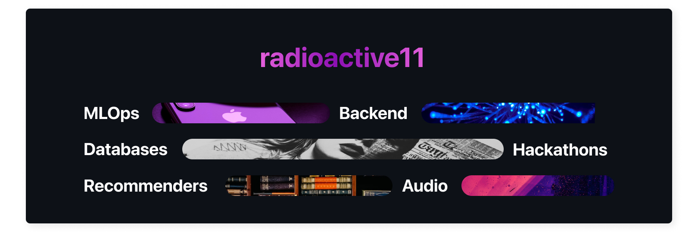

 
 

Lorem ipsum dolor sit amet, consectetur adipiscing elit, sed do eiusmod tempor incididunt ut labore et dolore magna aliqua. 
Duis aute irure dolor in reprehenderit in voluptate velit esse cillum dolore eu fugiat nulla pariatur. Excepteur sint occaecat cupidatat non proident, sunt in culpa qui officia deserunt mollit anim id est laborum.

Lorem ipsum dolor sit amet, consectetur adipiscing elit, sed do eiusmod tempor incididunt ut labore et dolore magna aliqua. 
Duis aute irure dolor in reprehenderit in voluptate velit esse cillum dolore eu fugiat nulla pariatur. Excepteur sint occaecat cupidatat non proident, sunt in culpa qui officia deserunt mollit anim id est laborum.

 

<h2>
Technologies I Use
</h2>
<!--  -->

<table style="border: none">
    <tr>
        <td> <b>Languages</b> </td>
        <td>
            
            
            
            
        </td>
    </tr>
    <tr>
        <td> <b>Languages</b> </td>
        <td>
            
            
            
            
        </td>
    </tr>
</table>

|               |               |
|:------------- |-------------:|
| **Languages**           | ![python] ![cpp] ![c] ![bash] ![swift] |
| **Web Frameworks**      | ![fastapi] ![flask] ![django] ![socketio]         |
| **Microservices**       | ![celery] ![rabbitmq] ![kafka]         |
| **SQL Databases**       | ![postgres] ![mysql] ![sqlite]         |
| **NoSQL Databases**     | ![mongodb] ![redis] ![elastic]         |
| **Data Engineering**     | ![pandas] ![numpy] ![airflow] ![scipy]        |
| **Machine Learning**     | ![sklearn] ![tf] ![keras] ![pytorch]           |
| **Cloud**     | ![azure] ![gcp] ![aws] ![heroku] ![vercel]          |
| **Tools**     | ![docker] ![git] ![postman] ![heroku] ![vercel]          |

<!-- Logo Marocs -->

<!-- Languages -->
[python]: https://img.shields.io/badge/Python-informational?style=flat&logo=python&logoColor=white&color=000000&labelColor=000000"
[cpp]: https://img.shields.io/badge/C++-informational?style=flat&logo=c%2b%2b&logoColor=black&color=fff&labelColor=000000"
[c]: https://img.shields.io/badge/C-informational?style=flat&logo=c&logoColor=white&color=000&labelColor=000000"
[bash]: https://img.shields.io/badge/Bash-informational?style=flat&logo=gnu-bash&logoColor=black&color=fff&labelColor=000000"
[swift]: https://img.shields.io/badge/Swift-informational?style=flat&logo=swift&logoColor=white&color=000&labelColor=000000"

<!-- Web Frameworks -->
[fastapi]: https://img.shields.io/badge/FastAPI-informational?style=flat&logo=FastAPI&logoColor=white&color=000&labelColor=000000"
[flask]: https://img.shields.io/badge/Flask-informational?style=flat&logo=flask&logoColor=black&color=fff&labelColor=000000"
[django]: https://img.shields.io/badge/django-informational?style=flat&logo=django&logoColor=white&color=000&labelColor=000000"
[socketio]: https://img.shields.io/badge/Socket%2eIO-informational?style=flat&logo=socket%2eio&logoColor=black&color=fff&labelColor=000000"

<!-- Microservices -->
[celery]: https://img.shields.io/badge/Celery-informational?style=flat&logo=celery&logoColor=white&color=000&labelColor=000000"
[rabbitmq]: https://img.shields.io/badge/RabbitMQ-informational?style=flat&logo=rabbitmq&logoColor=black&color=fff&labelColor=000000"
[kafka]: https://img.shields.io/badge/Kafka-informational?style=flat&logo=apache-kafka&logoColor=white&color=000&labelColor=000000"

<!-- SQL Databases -->
[postgres]: https://img.shields.io/badge/PostgreSQL-informational?style=flat&logo=postgresql&logoColor=white&color=000&labelColor=000000"
[mysql]: https://img.shields.io/badge/MySQL-informational?style=flat&logo=mysql&logoColor=black&color=fff&labelColor=000000"
[sqlite]: https://img.shields.io/badge/SQLite-informational?style=flat&logo=sqlite&logoColor=white&color=000&labelColor=000000"

<!-- NoSQL Databases -->
[mongodb]: https://img.shields.io/badge/MongoDB-informational?style=flat&logo=mongodb&logoColor=white&color=000&labelColor=000000"
[redis]: https://img.shields.io/badge/Redis-informational?style=flat&logo=redis&logoColor=black&color=fff&labelColor=000000"
[elastic]:  https://img.shields.io/badge/Elasticsearch-informational?style=flat&logo=elasticsearch&logoColor=white&color=000&labelColor=000000"

<!-- Data Engineering -->
[pandas]: https://img.shields.io/badge/Pandas-informational?style=flat&logo=pandas&logoColor=white&color=000&labelColor=000000"
[numpy]: https://img.shields.io/badge/NumPy-informational?style=flat&logo=numpy&logoColor=black&color=fff&labelColor=000000"
[airflow]:  https://img.shields.io/badge/Apache%20Airflow-informational?style=flat&logo=apache-airflow&logoColor=white&color=000&labelColor=000000"
[scipy]: https://img.shields.io/badge/SciPy-informational?style=flat&logo=scipy&logoColor=black&color=fff&labelColor=000000"

<!-- ML -->
[sklearn]: https://img.shields.io/badge/SciKitLearn-informational?style=flat&logo=scikit-learn&logoColor=white&color=000&labelColor=000000"
[tf]: https://img.shields.io/badge/TensorFlow-informational?style=flat&logo=tensorflow&logoColor=black&color=fff&labelColor=000000"
[keras]: https://img.shields.io/badge/Keras-informational?style=flat&logo=keras&logoColor=white&color=000&labelColor=000000"
[pytorch]: https://img.shields.io/badge/PyTorch-informational?style=flat&logo=pytorch&logoColor=black&color=fff&labelColor=000000"

<!-- Cloud -->
[azure]: https://img.shields.io/badge/Azure-informational?style=flat&logo=microsoft-azure&logoColor=white&color=000&labelColor=000000"
[aws]: https://img.shields.io/badge/Google%20Cloud-informational?style=flat&logo=google-cloud&logoColor=black&color=fff&labelColor=000000"
[gcp]: https://img.shields.io/badge/Keras-informational?style=flat&logo=keras&logoColor=white&color=000&labelColor=000000"
[heroku]: https://img.shields.io/badge/Heroku-informational?style=flat&logo=heroku&logoColor=black&color=fff&labelColor=000000"
[vercel]: https://img.shields.io/badge/Vercel-informational?style=flat&logo=vercel&logoColor=white&color=000&labelColor=000000"

<!-- Tools -->
[docker]: https://img.shields.io/badge/Docker-informational?style=flat&logo=docker&logoColor=white&color=000&labelColor=000000"
[git]: https://img.shields.io/badge/git-informational?style=flat&logo=git&logoColor=black&color=fff&labelColor=000000"
[postman]: https://img.shields.io/badge/Postman-informational?style=flat&logo=postman&logoColor=white&color=000&labelColor=000000"
